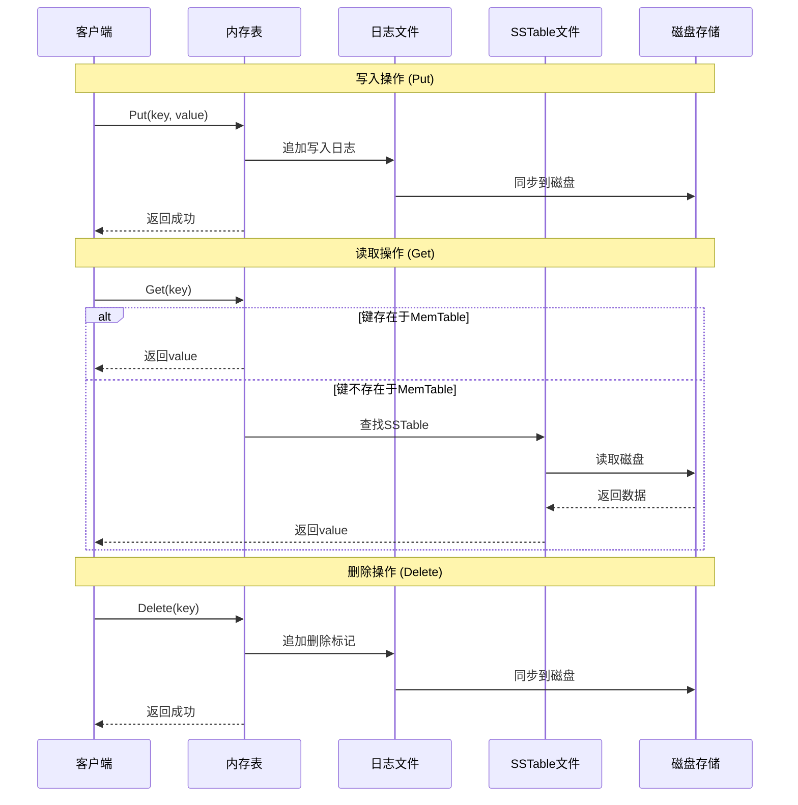
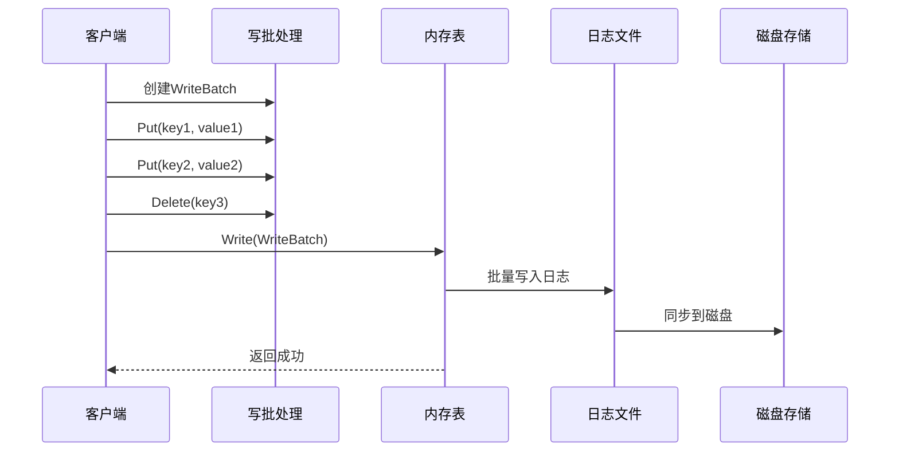
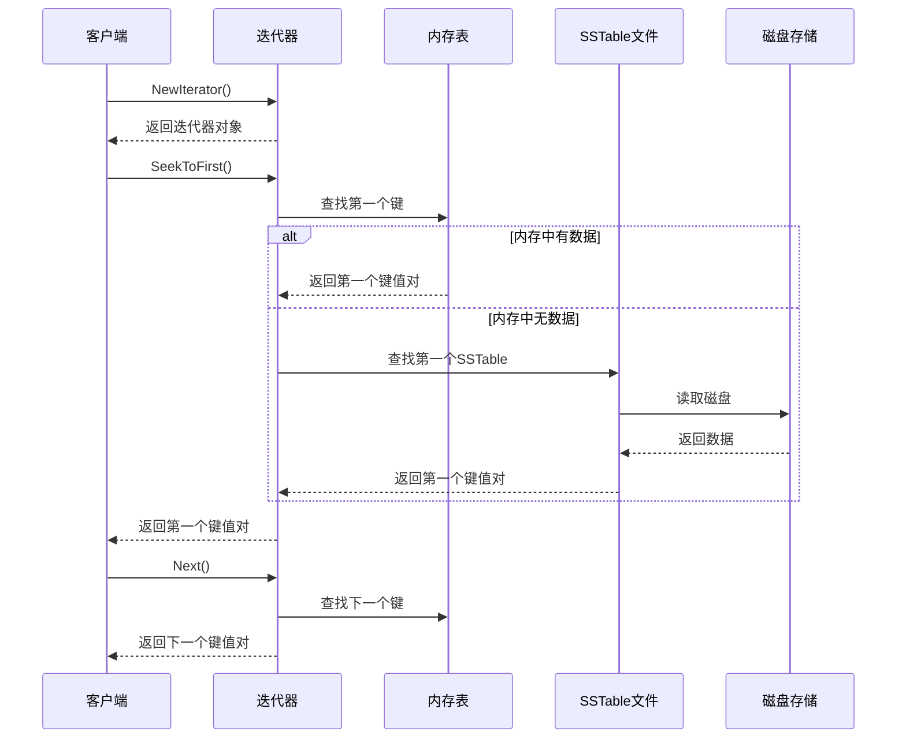
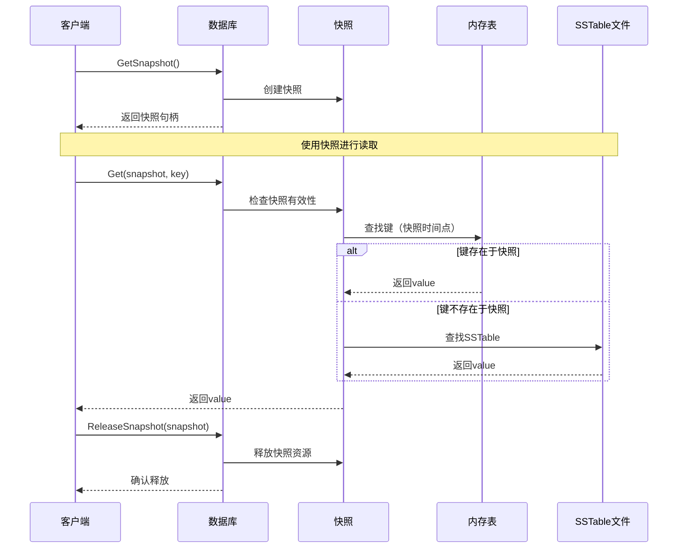
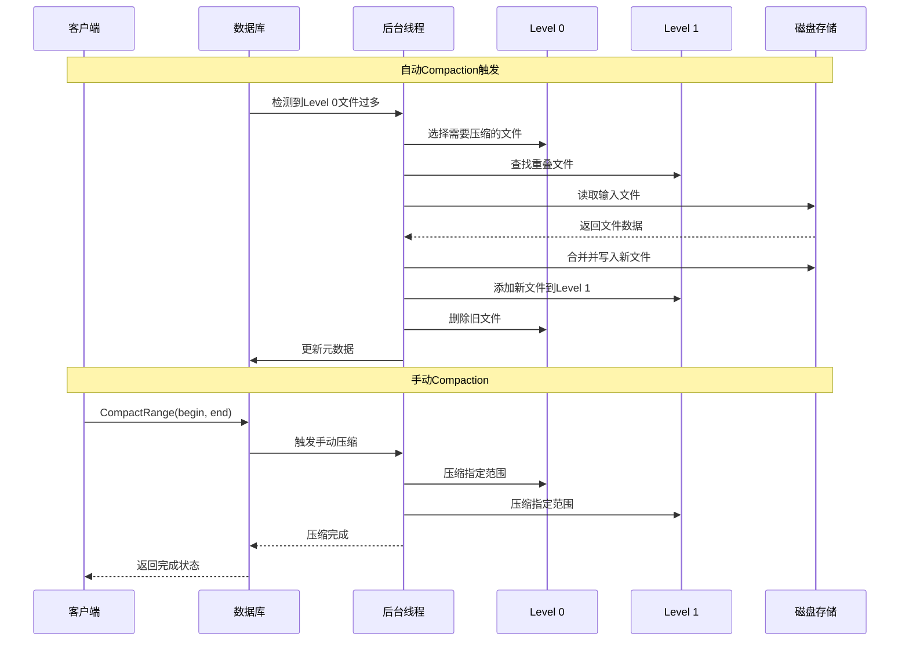
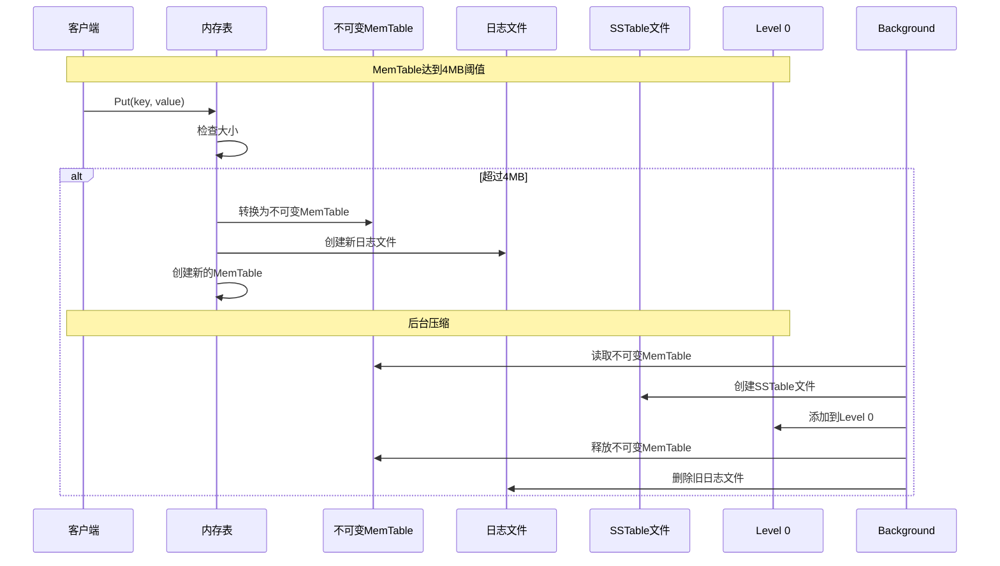
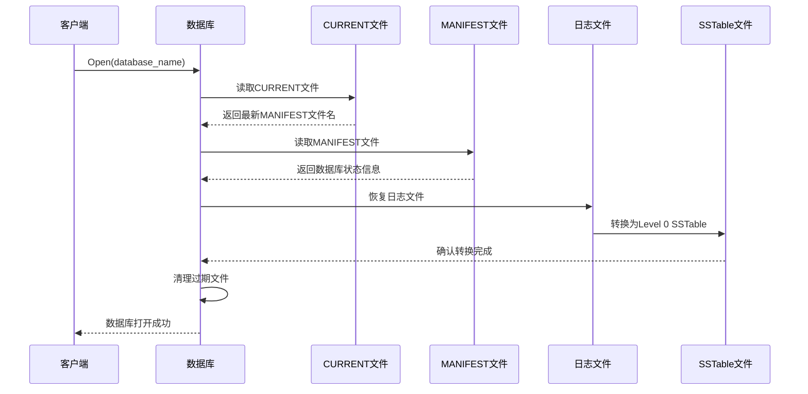
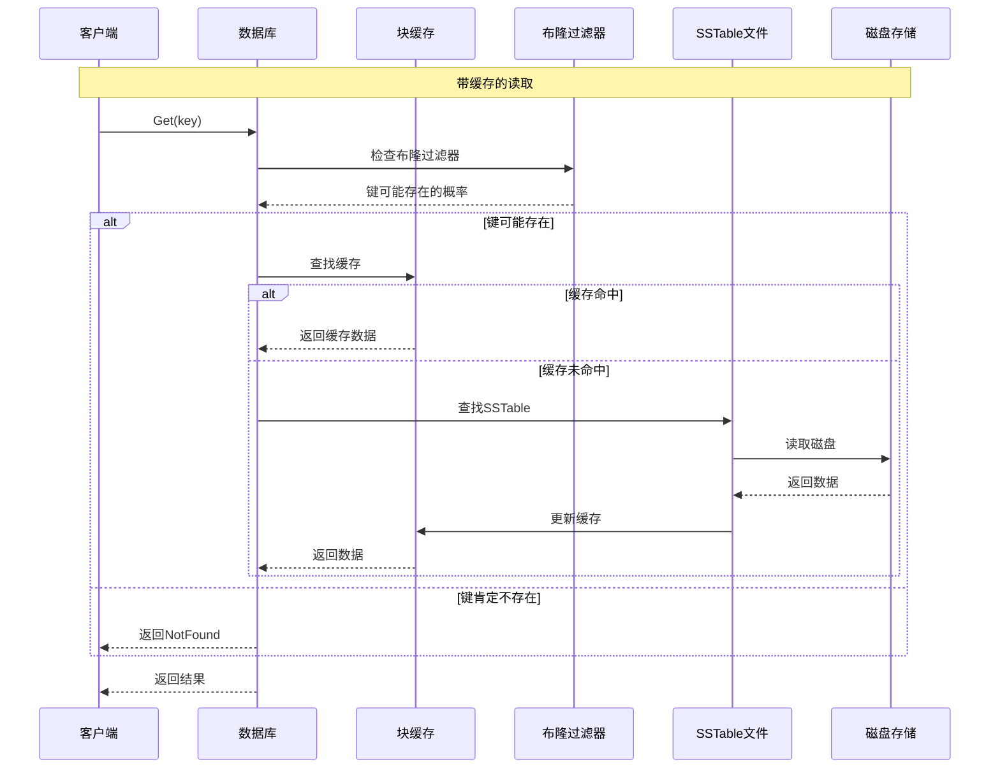
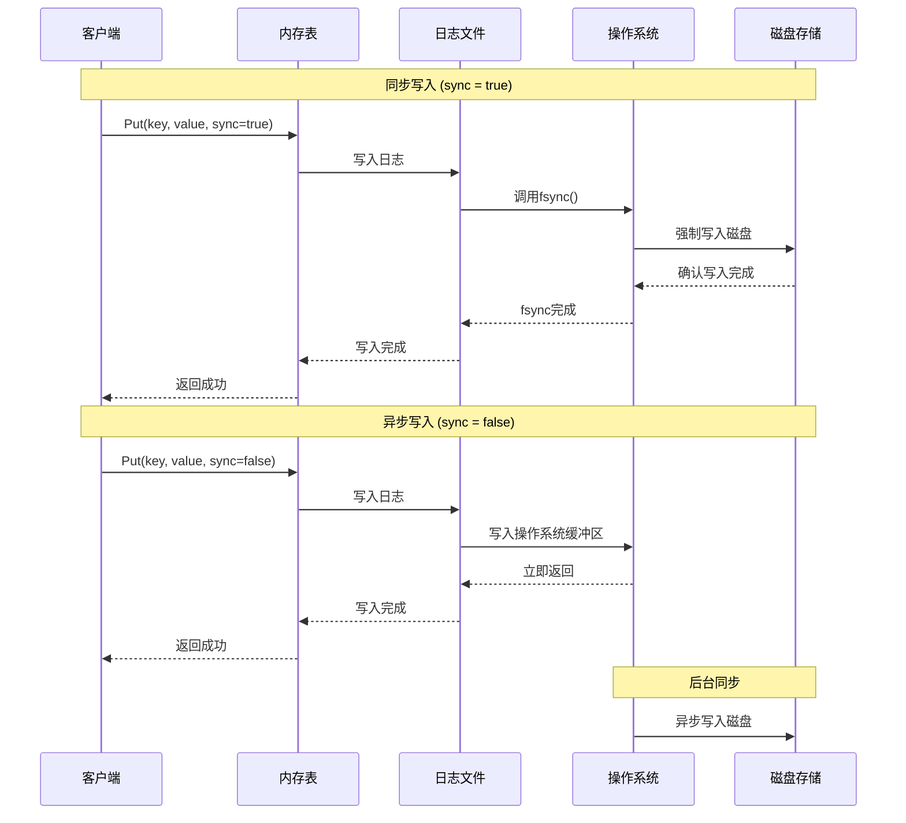
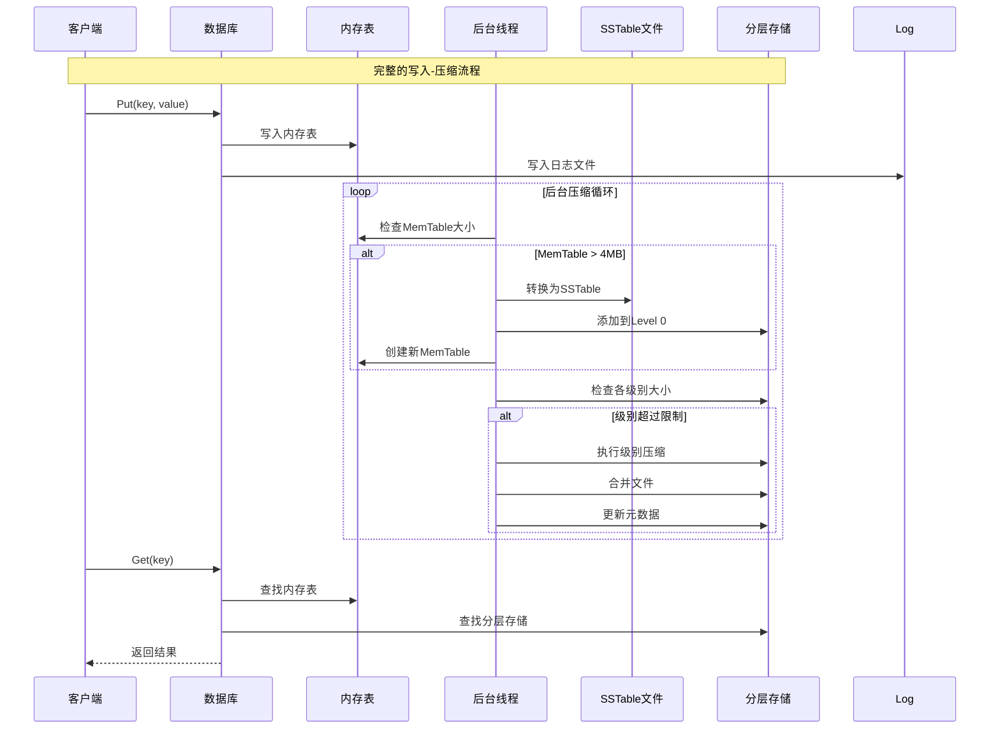

# LevelDB 完整分析文档

## 目录
1. [项目概述](#项目概述)
2. [核心原理](#核心原理)
3. [核心操作](#核心操作)
4. [操作时序图](#操作时序图)
5. [技术架构](#技术架构)
6. [性能特点](#性能特点)

---

## 项目概述

**LevelDB** 是由Google开发的一个高性能键值存储库，它提供了一个从字符串键到字符串值的有序映射。

### 主要特性

1. **键值存储**: 键和值都是任意的字节数组
2. **有序存储**: 数据按键进行排序存储
3. **自定义比较器**: 用户可以提供自定义的比较函数来覆盖排序顺序
4. **基本操作**: 支持 `Put(key,value)`、`Get(key)`、`Delete(key)` 操作
5. **原子批处理**: 可以在一个原子批次中进行多个更改
6. **快照支持**: 用户可以创建临时快照来获得数据的一致视图
7. **迭代支持**: 支持向前和向后迭代数据
8. **数据压缩**: 自动使用Snappy压缩库，也支持Zstd压缩
9. **可定制接口**: 外部活动通过虚拟接口中继，用户可以自定义操作系统交互

### 技术规格

- **语言**: C++
- **标准**: 支持C++11及以上
- **构建系统**: 支持CMake
- **平台**: 支持POSIX (Linux/macOS) 和Windows
- **压缩**: 支持Snappy和Zstd
- **作者**: Sanjay Ghemawat和Jeff Dean (Google)

### 使用场景

LevelDB特别适用于：
- 需要高性能键值存储的应用
- 嵌入式数据库需求
- 大数据处理和分析
- 缓存系统
- 日志存储

### 限制

1. **非关系型**: 不是SQL数据库，不支持关系数据模型、SQL查询或索引
2. **单进程访问**: 一次只能有一个进程访问特定数据库
3. **无内置服务器**: 没有内置的客户端-服务器支持

---

## 核心原理

### 1. **LSM树（Log-Structured Merge Tree）架构**

LevelDB采用LSM树作为其核心数据结构，这是一种专为写入密集型应用设计的存储引擎架构。

**核心思想**：
- 将随机写操作转换为顺序写操作
- 通过分层存储和后台合并来优化性能
- 牺牲部分读取性能来换取极高的写入性能

### 2. **分层存储机制**

#### **Level 0（年轻级别）**
- 新写入的数据首先进入内存中的`memtable`
- 当`memtable`达到4MB时，转换为SSTable文件并放入Level 0
- Level 0的文件可能包含重叠的键范围
- 最多允许4个文件存在

#### **Level 1+（成熟级别）**
- 每个级别的大小限制为：Level L = 10^L MB
- Level 1: 10MB, Level 2: 100MB, Level 3: 1000MB...
- 每个级别内的文件具有不同的、非重叠的键范围
- 文件大小约为2MB

### 3. **写入流程**

```
写入请求 → memtable → 日志文件
                ↓
            达到4MB阈值
                ↓
        转换为SSTable → Level 0
                ↓
            后台压缩
                ↓
            合并到Level 1+
```

**关键特性**：
- **追加写入**：所有写操作都是顺序追加到日志文件
- **内存缓冲**：活跃数据保持在内存中的`memtable`
- **批量转换**：定期将内存数据批量转换为磁盘文件

### 4. **压缩（Compaction）机制**

#### **触发条件**
- Level 0：文件数量超过4个
- 其他级别：总大小超过限制（10^L MB）

#### **压缩过程**
1. 选择一个Level L的文件
2. 找到Level L+1中所有重叠的文件
3. 合并这些文件，生成新的Level L+1文件
4. 删除旧文件，添加新文件

#### **压缩策略**
- **轮转压缩**：每个级别的压缩在键空间中轮转
- **边界控制**：确保压缩不会涉及过多下一级别的数据
- **后台执行**：压缩在后台线程中进行，不阻塞前台操作

### 5. **文件格式设计**

#### **SSTable结构**
```
[数据块1] [数据块2] ... [数据块N]
[元数据块1] ... [元数据块K]
[元数据索引块]
[数据索引块]
[文件尾部]
```

#### **关键组件**
- **数据块**：存储实际的键值对，按键排序
- **索引块**：快速定位数据块的位置
- **布隆过滤器**：快速判断键是否存在于文件中
- **压缩支持**：支持Snappy和Zstd压缩

### 6. **读取优化**

#### **多级查找**
1. 首先检查`memtable`（内存）
2. 然后检查Level 0（可能有重叠）
3. 最后检查Level 1+（无重叠，二分查找）

#### **布隆过滤器**
- 每个SSTable文件包含布隆过滤器
- 快速过滤不存在的键，减少不必要的磁盘访问

### 7. **恢复机制**

- 通过CURRENT文件找到最新的MANIFEST
- 读取MANIFEST重建数据库状态
- 将日志转换为Level 0的SSTable
- 清理过期文件

---

## 核心操作

### 1. **数据库生命周期操作**

#### **打开数据库**
```cpp
leveldb::DB* db;
leveldb::Options options;
options.create_if_missing = true;
leveldb::Status status = leveldb::DB::Open(options, "/tmp/testdb", &db);
```

#### **关闭数据库**
```cpp
delete db;  // 自动清理资源
```

### 2. **基本CRUD操作**

#### **写入操作 (Put)**
```cpp
leveldb::WriteOptions write_options;
write_options.sync = true;  // 同步写入
db->Put(write_options, "key1", "value1");
```

#### **读取操作 (Get)**
```cpp
std::string value;
leveldb::ReadOptions read_options;
leveldb::Status s = db->Get(read_options, "key1", &value);
```

#### **删除操作 (Delete)**
```cpp
leveldb::WriteOptions write_options;
db->Delete(write_options, "key1");
```

### 3. **批量操作**

#### **WriteBatch - 原子批量写入**
```cpp
leveldb::WriteBatch batch;
batch.Put("key1", "value1");
batch.Put("key2", "value2");
batch.Delete("key3");
db->Write(write_options, &batch);
```

**优势**：
- 原子性：要么全部成功，要么全部失败
- 性能：批量操作比单个操作效率更高
- 同步控制：可以统一设置同步选项

### 4. **迭代器操作**

#### **正向迭代**
```cpp
leveldb::Iterator* it = db->NewIterator(leveldb::ReadOptions());
for (it->SeekToFirst(); it->Valid(); it->Next()) {
    std::cout << it->key().ToString() << ": " << it->value().ToString() << std::endl;
}
delete it;
```

#### **范围迭代**
```cpp
for (it->Seek("start_key");
     it->Valid() && it->key().ToString() < "end_key";
     it->Next()) {
    // 处理范围内的键值对
}
```

#### **反向迭代**
```cpp
for (it->SeekToLast(); it->Valid(); it->Prev()) {
    // 反向处理
}
```

### 5. **快照操作**

#### **创建快照**
```cpp
leveldb::ReadOptions options;
options.snapshot = db->GetSnapshot();
```

#### **使用快照**
```cpp
leveldb::Iterator* iter = db->NewIterator(options);
// 使用迭代器查看快照创建时的状态
delete iter;
```

#### **释放快照**
```cpp
db->ReleaseSnapshot(options.snapshot);
```

### 6. **Compaction操作** ⭐ **核心维护操作**

#### **手动触发Compaction**
```cpp
// 压缩指定范围的键
db->CompactRange(&start_key, &end_key);

// 压缩整个数据库
db->CompactRange(nullptr, nullptr);

// 测试用的级别压缩（内部API）
db->TEST_CompactRange(level, &begin_key, &end_key);
```

#### **Compaction类型**
- **MemTable压缩**: 将内存中的memtable转换为SSTable
- **Level压缩**: 将不同级别的文件进行合并
- **手动压缩**: 用户主动触发的压缩操作

### 7. **数据库管理操作**

#### **数据库销毁**
```cpp
// 完全销毁数据库及其所有文件
leveldb::Status status = leveldb::DestroyDB("/tmp/testdb", options);
```

#### **数据库修复**
```cpp
// 尝试修复损坏的数据库
leveldb::Status status = leveldb::RepairDB("/tmp/corrupted_db", options);
```

### 8. **监控和诊断操作**

#### **获取数据库属性**
```cpp
std::string property_value;

// 获取各级别的文件数量
db->GetProperty("leveldb.num-files-at-level0", &property_value);
db->GetProperty("leveldb.num-files-at-level1", &property_value);

// 获取数据库统计信息
db->GetProperty("leveldb.stats", &property_value);

// 获取SSTable信息
db->GetProperty("leveldb.sstables", &property_value);

// 获取内存使用情况
db->GetProperty("leveldb.approximate-memory-usage", &property_value);
```

#### **获取近似大小**
```cpp
leveldb::Range ranges[2];
ranges[0] = leveldb::Range("a", "c");
ranges[1] = leveldb::Range("x", "z");
uint64_t sizes[2];
db->GetApproximateSizes(ranges, 2, sizes);
```

### 9. **性能优化操作**

#### **缓存管理**
```cpp
// 配置块缓存
leveldb::Options options;
options.block_cache = leveldb::NewLRUCache(100 * 1048576);  // 100MB

// 禁用特定迭代器的缓存
leveldb::ReadOptions read_options;
read_options.fill_cache = false;
```

#### **压缩配置**
```cpp
leveldb::Options options;
options.compression = leveldb::kSnappyCompression;  // Snappy压缩
options.compression = leveldb::kZstdCompression;    // Zstd压缩
options.compression = leveldb::kNoCompression;      // 禁用压缩
```

#### **布隆过滤器配置**
```cpp
leveldb::Options options;
options.filter_policy = NewBloomFilterPolicy(10);  // 10位/键
```

### 10. **同步和持久化操作**

#### **写入同步控制**
```cpp
leveldb::WriteOptions write_options;
write_options.sync = true;   // 同步写入，确保数据持久化
write_options.sync = false;  // 异步写入，性能更高但可能丢失数据
```

#### **校验和验证**
```cpp
leveldb::ReadOptions read_options;
read_options.verify_checksums = true;  // 强制验证校验和
```

#### **偏执检查**
```cpp
leveldb::Options options;
options.paranoid_checks = true;  // 启用偏执检查，发现损坏立即报错
```

### 11. **环境定制操作**

#### **自定义环境实现**
```cpp
class CustomEnv : public leveldb::Env {
    // 实现自定义文件系统操作
    // 实现自定义线程调度
    // 实现自定义时间函数
};

leveldb::Options options;
options.env = &custom_env;
```

### 12. **比较器定制操作**

#### **自定义键比较器**
```cpp
class CustomComparator : public leveldb::Comparator {
public:
    int Compare(const leveldb::Slice& a, const leveldb::Slice& b) const;
    const char* Name() const;
    // 其他必要方法...
};

leveldb::Options options;
options.comparator = &custom_comparator;
```

## 操作特点总结

1. **线程安全**：DB对象可以在多线程间安全共享
2. **原子性**：WriteBatch提供批量原子操作
3. **一致性**：快照提供一致的数据视图
4. **性能优化**：支持缓存、压缩、布隆过滤器等
5. **可定制性**：支持自定义比较器、环境、过滤器策略
6. **错误处理**：所有操作都返回Status对象进行错误检查

---

## 操作时序图

### 1. **基础CRUD操作时序图**



### 2. **批量操作 (WriteBatch) 时序图**



### 3. **迭代器操作时序图**



### 4. **快照操作时序图**



### 5. **Compaction操作时序图**



### 6. **MemTable压缩时序图**



### 7. **数据库恢复时序图**



### 8. **性能优化操作时序图**



### 9. **同步写入操作时序图**



### 10. **整体操作流程时序图**



---

## 技术架构

### 文件组织
- **日志文件 (*.log)**: 存储最近的更新序列
- **排序表 (*.ldb)**: 存储按键排序的条目序列
- **MANIFEST文件**: 列出组成每个级别的排序表集合
- **CURRENT文件**: 包含最新MANIFEST文件的名称
- **信息日志**: LOG和LOG.old文件

### 分层存储
- **Level 0**: 年轻级别，文件可能包含重叠的键
- **Level 1+**: 其他级别，文件具有不同的非重叠键范围
- **压缩机制**: 当级别大小超过限制时，后台线程会进行压缩

---

## 性能特点

### 写入性能优势
- 顺序写入，避免随机寻道
- 内存缓冲，批量处理
- 后台压缩，不阻塞写入

### 读取性能权衡
- 可能需要检查多个文件
- 但通过分层和索引优化
- 布隆过滤器减少无效查找

---

## 总结

LevelDB的核心原理是通过**LSM树架构**将随机写转换为顺序写，通过**分层存储**和**后台压缩**来平衡读写性能。这种设计特别适合写入密集型场景，如日志系统、时序数据库等，是现代NoSQL数据库的重要技术基础。

这些操作构成了LevelDB完整的键值存储功能，支持从简单的读写到复杂的高级查询和优化配置。特别是compaction操作是LevelDB性能优化的核心机制，通过后台的自动压缩和用户的手动触发，保证了数据库的长期性能和空间效率。 